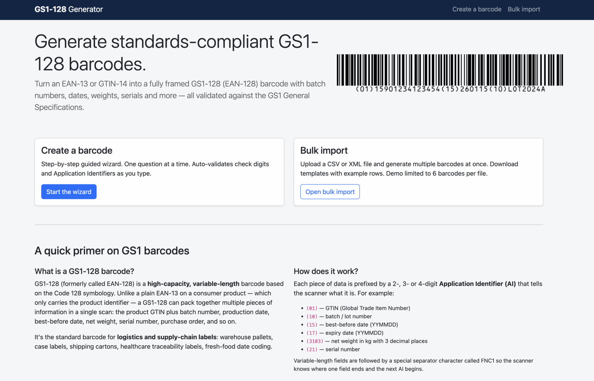
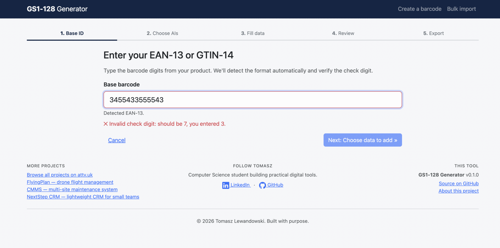
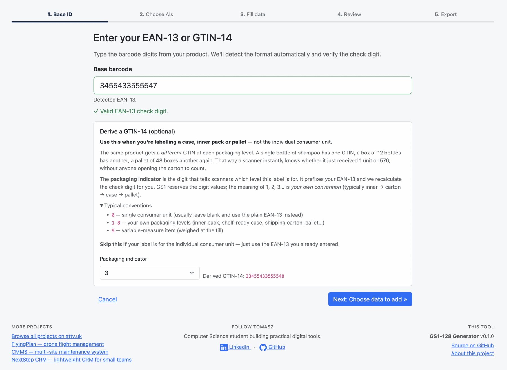
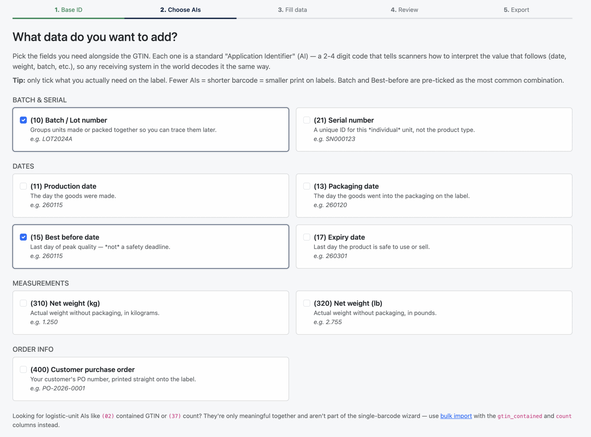
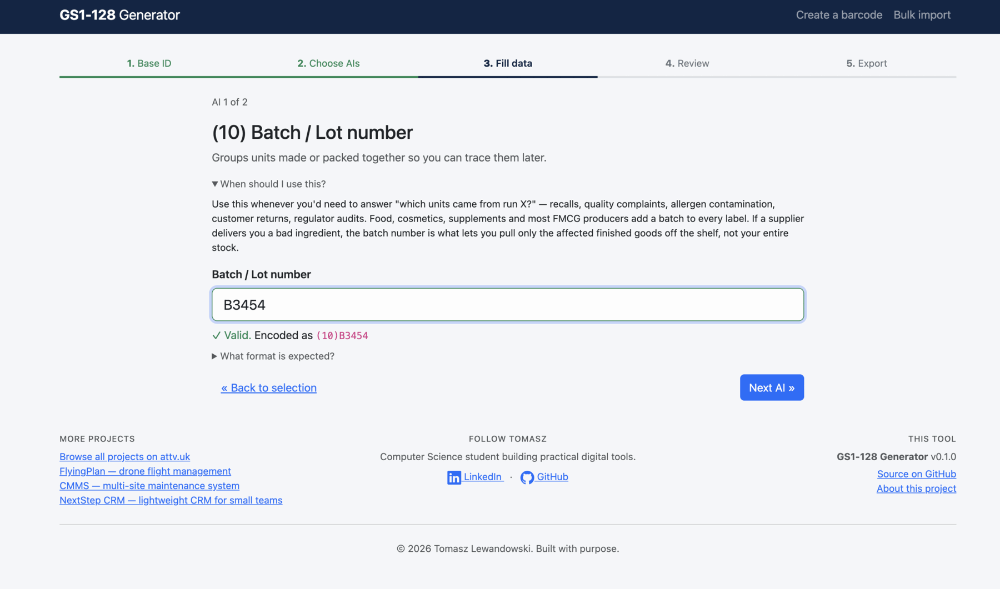
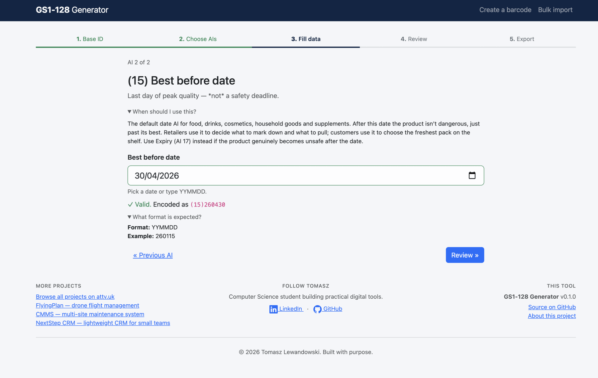
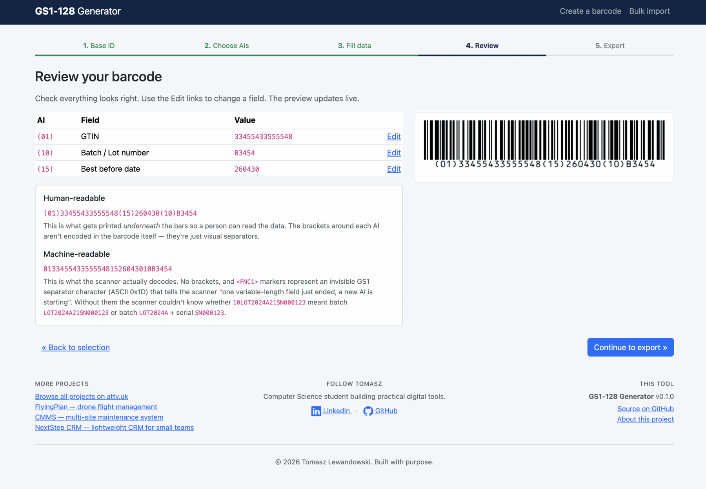
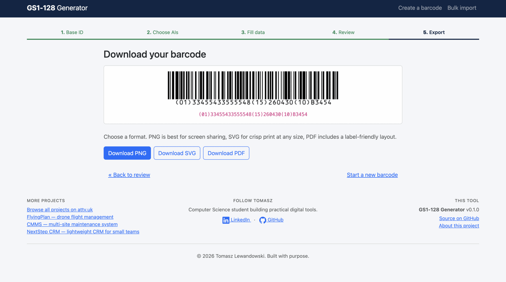
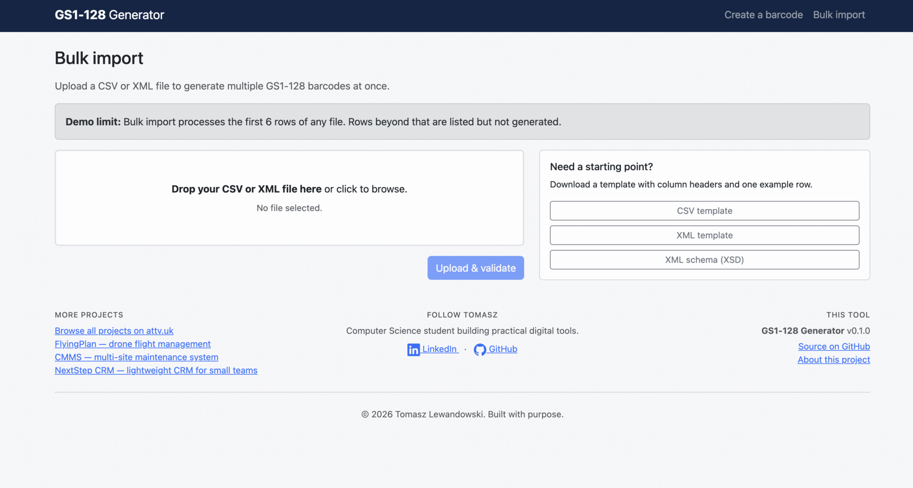

# GS1-128 Barcode Generator

A web-based tool that generates standards-compliant **GS1-128 / EAN-128** barcodes from EAN-13 or GTIN-14 inputs, with optional Application Identifiers (batch numbers, dates, weights, serials, etc.). Includes a guided single-barcode wizard and a CSV/XML bulk-import flow.

**Live demo:** [attv.uk/projects/GS1-128-barcode-generator/](https://attv.uk/projects/GS1-128-barcode-generator/) · Status: **v0.1.0** — wizard + bulk import live, no DB required.



## Screenshots

### The 5-step wizard

|  |  |
|:---|:---|
| **Step 1 — instant check-digit validation.** Tells you which digit is wrong rather than a generic "invalid input". | **Step 1 — optional GTIN-14 derivation.** Convert an EAN-13 into a case- or pallet-level GTIN; check digit is recalculated automatically. |
|  |  |
| **Step 2 — choose Application Identifiers.** Card-grid picker grouped by category, with the most common combination pre-ticked. | **Step 3 — one AI per screen.** Plain-English "When should I use this?" guidance, instant validation, live encoding preview. |
|  |  |
| **Step 3 — date inputs.** Native date picker or YYMMDD; converted to GS1 format with the encoded value shown below. | **Step 4 — review with live preview.** Both human- and machine-readable strings shown side-by-side with an explanation of FNC1 separators. |

### Export and bulk import

|  |  |
|:---|:---|
| **Step 5 — download.** PNG (screen), SVG (print at any size) or PDF (label-friendly layout). | **Bulk import.** Drag a CSV or XML file to generate up to 6 barcodes per upload; templates and XSD schema linked. |

## Features

- **Guided wizard** — five steps, one question at a time, instant validation feedback, live barcode preview (`bwip-js`).
- **Bulk import** — upload CSV or XML (XSD-validated), per-row validation report, demo limit of 6 rows per file.
- **Server-side rendering** — PNG and SVG via [`picqer/php-barcode-generator`](https://github.com/picqer/php-barcode-generator), PDF and label sheets via TCPDF.
- **Validation engine** — GS1 mod-10 check digits (EAN-13, GTIN-14), AI-aware value validation (Set 82 charset, date format incl. DD=00, decimal weight encoding for 310x/320x), AI combination rules, 48-character symbol cap.
- **Hosting-portable** — no hardcoded URLs or paths; reachable under any default Apache vhost as a subfolder.

## Tech

| Layer | Choice |
|---|---|
| Backend | PHP 8.1+ |
| Frontend | Vanilla JS + Bootstrap 5 (CDN) |
| Barcode (server) | `picqer/php-barcode-generator` |
| Barcode (browser preview) | `bwip-js` (CDN) |
| PDF | `tecnickcom/tcpdf` |
| Tests | PHPUnit 10 |

## Local setup

```bash
git clone git@github.com:AmigoUK/GS1-128-generator.git
cd GS1-128-generator
composer install
chown -R www-data:www-data storage
```

Drop the folder under your Apache `DocumentRoot` (e.g. `/var/www/html/`) and visit:

```
http://<host>/GS1-128-generator/
```

`mod_rewrite` and `mod_headers` should be enabled.

## Run tests

```bash
./vendor/bin/phpunit
```

32 tests cover check-digit arithmetic, AI value validation, combination rules, GS1 string assembly, and the renderer.

## Routes

| Path | Purpose |
|---|---|
| `/` | Landing page |
| `/wizard` | Step 1 — input EAN-13 / GTIN-14 |
| `/wizard/select-ai` | Step 2 — pick Application Identifiers |
| `/wizard/ai-data` | Step 3 — fill AI values (one per screen) |
| `/wizard/review` | Step 4 — review + live preview |
| `/wizard/export` | Step 5 — download PNG/SVG/PDF |
| `/bulk` | Bulk import upload |
| `/bulk/validate` | Per-row validation report |
| `/bulk/results` | Bulk download options |
| `/api/generate` | POST — server-side render of a single barcode |
| `/download/template.csv` | Bulk import CSV template |
| `/download/template.xml` | Bulk import XML template |
| `/download/schema.xsd` | XML schema for bulk imports |

## Demo limit

The bulk import processes the **first 6 rows** of any uploaded file. Rows beyond row 6 are listed in the validation report (greyed with a lock icon) but are not generated. The single-barcode wizard has no limit.

## Security notes

- Front controller (`index.php`) is the only PHP entrypoint; `includes/`, `storage/`, `vendor/`, and `composer.json/lock` are blocked at the Apache level via `.htaccess`.
- Uploaded files are size-capped (5 MB), extension-checked, stored under a random name, parsed, and immediately deleted.
- Every payload sent to `/api/generate` is **re-validated server-side** against the same engine the wizard uses; the client validation is for UX, not authority.
- `X-Content-Type-Options: nosniff` and `X-Frame-Options: SAMEORIGIN` set globally.

## Specification

The complete technical specification (check digit arithmetic, AI table, FNC1 rules, Code 128 encoding) is in [`SPECIFICATION.md`](SPECIFICATION.md).

## Author

Tomasz "Amigo" Lewandowski — dev@attv.uk
